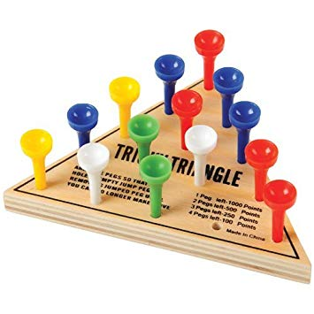

# TrickyTriangle

The Tricky Triangle is a puzzle with a simple goal: hop neighboring pegs over one another until only one is left.

It's really frustrating so good luck winning it. Much easier to write some code to solve it for you!

This code finds the solution to a Tricky Triangle of (theoretically) any size. It works fine with a normal board size of 15 holes but starts to choke around boards of 45 holes.

## Requirements
Python 3.7

## Synopsis
* Default - Five holes per side, random empty starting position
  - python TrickyTriangle.py
* Set board size to six holes per side
  - python TrickyTriangle.py 6
* Set board size to eight holes per side and specific hole 1 as empty starting position
  - python TrickyTriangle.py 8 1

## Description
Tricky Triangle is a physical game consisting of an equilateral triangle having 15 holes and 14 pegs.
The board is set up by placing the pegs in any of the available holes, leaving one hole open.
A peg can jump over another peg to an empty spot, removing the jumped peg in the process.
The game ends when there are no more possible moves.
To win the game, you need to have only one peg left on the board!

The output of this script is an ordered list of moves that wins the game. Positions are numbered from the top,
e.g. 1 is the hole at the top of the triangle and 15 is the hole at the bottom right.

## Example

$ python TrickyTriangle.py  
Board size 15  
Starting with empty hole: 13  
Game 15 is a winner!  
11 -> 13  
14 -> 12  
6 -> 13  
1 -> 6  
4 -> 11  
10 -> 3  
13 -> 4  
3 -> 8  
2 -> 7  
11 -> 4  
4 -> 13  
12 -> 14  
15 -> 13  

## TODO
* Improve how moves are selected so that this code can scale to a board of any size
